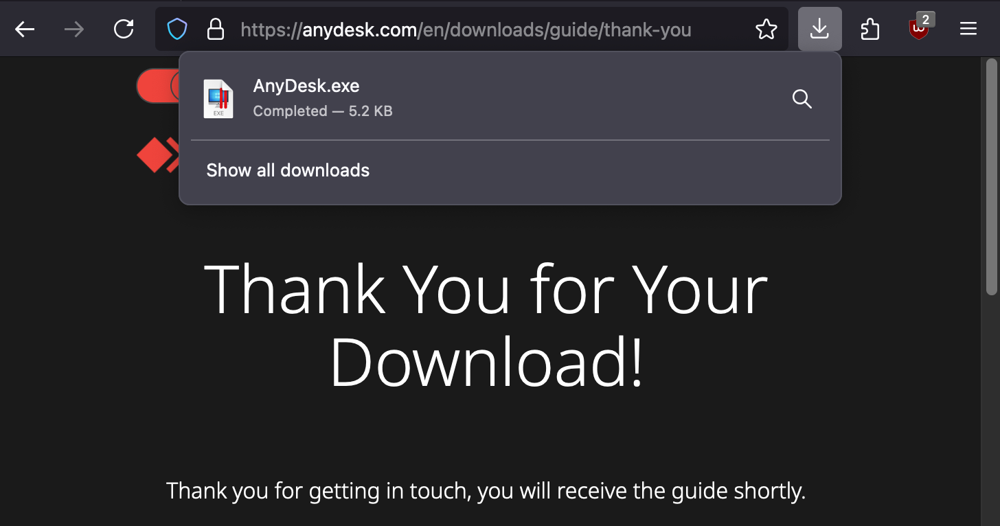

# self-unzip.html
[](https://pypi.org/project/self-unzip-html/)


This [repo](https://github.com/six-two/self-unzip.html) contains tools to create self-extracting HTML pages.
It works by taking a payload, compressing it, and encoding the results using ASCII85.
It then puts the resulting string in a template file, that contains the code to decode and decompress the payload again.

Currently there are three actions implemented, that can be executed, after the payload is decoded:

- `eval`: Execute payload as JavaScript code (example usecase: obfuscate malicious JS code)
- `replace`: Show payload as HTML page (example usecase: compress a big web page)
- `download`: Download the payload as a file (example usecase: bypass antivirus / filters)

## Demo

You can try the online demo at [self-extracting-html.six-two.dev](https://self-extracting-html.six-two.dev/).
This version is the same as the web version described below.
It is entirely client-site, your files do not get uploaded to a server.

## Installation

### Current feature comparision

Currently the python version has the most features.

Feature | Web version | Python version
---|---|---
Base64 encoding | no | yes
Ascii85 encoding | yes | yes
GZIP compression | yes, always | yes, can be disabled
AES-GCM encryption | no | yes
Automatic detection of most efficient algorithms | no | yes

### Python version

A Python script to generate self extracting web pages is under `python/main.py`.
It just requires a modern Python version (probably Python3.9+) and has no required external dependencies (but you need to install `pycryptodomex` if you want to encrypt contents).

You can also install it with `pip`:

```bash
python3 -m pip install -U self-unzip-html
```

Example usage of the pip package:
```bash
self-unzip-html -t download -o psexec.html ~/Downloads/SysinternalsSuite/PsExec.exe
```

Or if you wanted to password-protect it:
```bash
self-unzip-html -t download -o psexec.html -p YourPasswordHere ~/Downloads/SysinternalsSuite/PsExec.exe
```

#### Phishing

If you want to use it for phishing (sending a download link to a malicious file), the `--driveby-redirect` is likely what you want. It starts a download and immediately redirects to any URL you choose, so that it looks like the other site started the download:



Just search for a "thank you for downloading" page that does not start a download. There are many of them for software like Skype, AnyDesk, etc. Then rename your payload file to something an visitor of the download page would expect and create the HTML smuggling page:
```bash
self-unzip-html.py AnyDesk.exe -o anydesk-download.html --driveby-redirect https://anydesk.com/en/downloads/guide/thank-you --obscure-action
```

Host that HTML file on your server and link to it in your emails.

#### Encryption

Encryption uses AES-GCM for encryption and tamper detection and PBKDF2 with slightly over 1 million rounds of SHA-256 for password derivation.
The code has not been audited, so use it with caution.
If data security is very important to you may want to manually encrypt it beforehand (for example using `gpg`).

You can automatically decrypt a page by adding the password as the hash in a URL like `encrypted.html#monkey123!`.
The hash will not be sent to the server, so your password may only be stored locally (in your browsing history).
Otherwise a prompt will ask you for the password.

### Web version

There is a bare-bones page generator written in plain HTML and JavaScript.
To use it, just clone the repo and put the contents of the `site` directory somewhere in your web server directory.

You can of course also use it with Python's built in web server:
```bash
python3 -m http.server --directory ./site/
```

I also host it via Vercel at <https://self-extracting-html.six-two.dev/>.

## JavaScript code

### Python

The JavaScript code is modular to decrease size and allow mixing and matching different algorithms.
The unminified files are in `code_to_minify/`.
They are minified by running `code_to_minify/build.sh`, which updates `python/self_unzip_html/minified_js.py`.

### template.html

This basically just explains, how I generated the obfuscated script in `template.html` (JavaScript version).
In case you are paranoid, you can reproduce the steps.
Or if there is an important update to `fflate` or `ascii85`, I will have to run them again.

Install with npm:

```bash
npm install .
```

First use rollup to only select the actually used code:

```bash
./node_modules/.bin/rollup -c rollup.config.js
```

This command should create `output/main.js`

The next step is optional.
If you want to skip it, just rename `main.min.js` to `main.js` in the `output` directory.
Otherwise minify the code (may require you to install an external minifier like closure-compiler).

```bash
closure-compiler output/main.js --js_output_file output/main.min.js
```

## Notable changes

### Version 0.2.0

- **Breaking change**: Replaced the `--type` parameter with specific flags like `--download`, `--driveby-redirect`, `--eval`, `--replace`, and `--custom`.
    - `--download` now has an optional parameter that allows you to change the file's name.
    - `--driveby-redirect` allows you to perform a driveby download and redirect the visitor immediately to another page.
    - `--custom` allows you to provide your own JavaScript code, which is useful for not implemented techniques or special usecases.
- Password protection now encrypts the payload action too.
    This should prevent anyone without the password from inspecting the file and for example seeing that it performs a drive by download and redirects to a specific site.
- The debugging console messages are disabled by default, which results in nicer and shorter code.
    If enabled with the `--console-log` flag, the data will be formatted as hex dumps for easier debugging.
- Added `--html`, `--html-file` and `--title` options to change the visual appearence of the initial page without needing a whole custom template.
